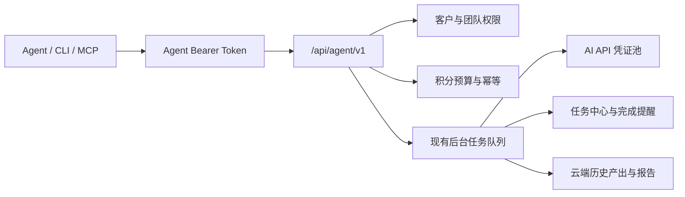

# 势途 GEO Agent 接入指南

## 设计原则

Agent、网页、CLI 和 MCP 共用同一套业务入口。Agent 不会直接读取数据库、绕过积分、修改模型 Prompt，或接触大模型供应商 API Key。



## 最快接入

所有正常登录用户都可以进入 `/account/agents`：

1. 选择 Codex、Claude、Cursor、通用 MCP、CLI 或 OpenAPI。
2. 选择只读观察或业务执行，并只开放必须访问的客户。
3. 设置每日积分上限、单任务积分上限和请求频率。
4. 创建密钥后立即复制或下载页面生成的配置。
5. 点击“测试连接”。测试只读取权限和客户目录，不扣积分。

公开说明页为 `https://shitugeo.top/agent`，生产接口默认地址为 `https://shitugeo.top/api/agent/v1`，OpenAPI 为 `/api/agent/v1/openapi.json`。

## CLI

无需下载网站源码，可直接下载独立 CLI：

```bash
curl -fsSL https://shitugeo.top/downloads/shitu-geo.mjs -o shitu-geo.mjs
node shitu-geo.mjs auth set --token "$SHITU_GEO_TOKEN" --base-url https://shitugeo.top
node shitu-geo.mjs clients list --json
node shitu-geo.mjs tasks list --json
```

配置文件在 macOS/Linux 的 `~/.config/shitu-geo/config.json`，Windows 的 `%APPDATA%\\shitu-geo\\config.json`，Unix 权限固定为 `0600`。

## MCP

远程 Streamable HTTP 地址为 `https://shitugeo.top/api/agent/mcp`，认证头为 `Authorization: Bearer <Agent Token>`。接入中心会按选择的 Agent 自动生成配置。

Codex 可在 `~/.codex/config.toml` 中使用：

```toml
[mcp_servers.shitu_geo]
url = "https://shitugeo.top/api/agent/mcp"
bearer_token_env_var = "SHITU_GEO_TOKEN"
default_tools_approval_mode = "writes"
```

Claude Code 可使用 `claude mcp add --transport http`；Cursor 和其他 MCP Agent 使用页面生成的 `mcp.json`。

## 推荐工作流

任何会扣积分的动作都按以下顺序执行：

1. `shitu_list_clients` 获取准确的 `clientId` 和可选 `teamId`。
2. `shitu_get_client` 只读取任务需要的资料区段。
3. 使用稳定的 `requestId`，先提交 `dryRun: true`。
4. 向用户展示预计积分、问题数和模型数，并等待 Agent 宿主的执行确认。
5. 使用相同 `requestId` 正式提交。
6. 根据返回的 `task.taskId` 查询任务中心；不要保持 HTTP 长连接等待业务完成。
7. 完成后读取 `task.resultUrl`，或从不可变历史产出中读取结果。
8. PDF 和文章 ZIP 使用下载端点或 MCP 受保护资源，不嵌入普通 JSON。

相同 `requestId` 重试会返回原任务或原同步结果，不会重复创建业务任务、重复调用 AI 或重复占用 Agent 日预算。同一 `requestId` 携带不同参数会返回 `IDEMPOTENCY_CONFLICT`；仍在处理时返回可重试的 `REQUEST_IN_PROGRESS`。
CLI 的 `tasks watch` 会在任务长时间无新进度时自动降低轮询频率，有新进度后立即恢复，避免多 Agent 同时等待时挤占服务。

## 渗透率检测示例

```json
{
  "clientId": "client_xxx",
  "requestId": "agent_penetration_20260801_001",
  "ourBrand": "示例品牌",
  "brandAliases": ["示例英文名"],
  "industry": "示例行业",
  "competitors": [],
  "questions": [
    "示例行业有哪些值得推荐的品牌？",
    "选择示例产品时应该重点看什么？"
  ],
  "models": ["doubao", "qwen", "kimi"],
  "operation": "replace",
  "dryRun": true
}
```

提交地址：`POST /api/agent/v1/actions/penetration.run`。每个模型仍只收到用户原始疑问句，联网预检、独立回答、信源提取和品牌裁判逻辑与网页端一致。

## 难度测评示例

```json
{
  "clientId": "client_xxx",
  "requestId": "agent_difficulty_20260801_001",
  "model": "auto",
  "mode": "brand",
  "industry": "高端医疗服务",
  "region": "全国",
  "scope": "national",
  "targetBrand": "示例品牌",
  "website": "https://example.com",
  "commercial": {
    "averageOrderValue": 10000,
    "grossMarginRate": 60,
    "annualRepeatPurchases": 1,
    "riskLevel": "regulated"
  },
  "dryRun": true
}
```

## 功能覆盖与人工边界

Agent 的目标是接管客户业务工作流，而不是接管账号和资金安全。当前正式覆盖：

- 渗透率联网检测、问题生成、品牌重析和 1 至 7 天自动复测。
- 强制联网的独立调研、竞品对比、AI 网站诊断和难度测评。
- 客户资料导入与审核、联网关键词策略、疑问句池、优势和发布规划。
- 单篇、改写、批量、AI 选稿、批量配图和按平台内容生产。
- 执行动作、证据批量导入、客户可见范围、周月报与自动邮件报送。
- 后台任务、不可变历史产出、专业报告、文章和分平台 ZIP 下载。

以下操作刻意保持人工处理，不属于遗漏：充值与积分调整、发票、邮箱密码、模型 API Key、团队成员、客户账号授权、管理员审核和财务处理。客户创建、归档和删除也保留在“我的主页”，防止自动化误建或误删客户档案。

## 专用动作

Agent 1.8 已将旧版 `background.run` 拆成可发现、可校验的专用动作，并补齐近期网页功能：

| 模块 | 动作 |
| --- | --- |
| 渗透率情报 | `penetration.run`、`penetration.questions.generate`、`penetration.automation.get`、`penetration.automation.save`、`penetration.automation.set-status`、`penetration.automation.run`、`penetration.automation.delete` |
| 独立调研 | `research.run`、`research.compare` |
| AI 诊断 | `diagnosis.run` |
| 难度测评 | `difficulty.run` |
| 关键词策略 | `keyword.extract`、`keyword.advantages`、`keyword.strategy.run`、`keyword.website-prompt.run`、`keyword.questions.run`、`publishing.plan.get`、`publishing.plan.recommend`、`publishing.plan.create`、`publishing.plan.activate`、`publishing.plan.delete`、`publishing.tasks.list`、`publishing.tasks.claim`、`publishing.task.complete`、`publishing.task.fail` |
| 文章生成 | `article.generate`、`article.rewrite`、`article.batch.run`、`article.batch.delete`、`article.strategy.plan`、`article.source.extract`、`article.brands.analyze`、`article.materials.list`、`article.materials.import`、`article.materials.delete`、`article.media.upload`、`article.media.run`、`article.production.list`、`article.production.run`、`article.production.get`、`article.production.cancel` |
| 执行反馈 | `feedback.action.create`、`feedback.action.delete`、`feedback.actions.import`、`feedback.report.create`、`feedback.report.options`、`feedback.report.manage`、`feedback.profile.update`、`feedback.visibility.update`、`feedback.automation.get`、`feedback.automation.save`、`feedback.automation.set-status`、`feedback.automation.run`、`feedback.automation.retry`、`feedback.automation.delete`、`feedback.reminder-settings.get`、`feedback.reminder-settings.update` |
| 客户资料库 | `knowledge.import`、`knowledge.commit` |
| 专业报告 | `report.create` |

每个动作在 OpenAPI 和 MCP 中都有独立 Schema。`background.run` 仅用于兼容旧 Agent，不建议新流程继续使用。

## 完整工作流

### 自动渗透率监测

1. `penetration.automation.get` 读取当前计划和最近 12 次执行。
2. `penetration.automation.save` 创建或更新 1–7 天间隔、执行时间、下降阈值、消息与邮件提醒。
3. `penetration.automation.set-status` 暂停或恢复计划。
4. `penetration.automation.run` 立即触发一次；之后通过 `penetration.automation.get` 查看执行记录，并从任务中心读取实际检测任务。
5. `penetration.automation.delete` 只删除计划，不删除历史报告。

### 关键词策略自动成文

1. `article.materials.list` 分页读取 Excel 导入的疑问句与优势；关键词策略内置疑问句可从客户资料的 `keywordStrategy` 区段读取。
2. `article.strategy.plan` 让系统 AI 裁判按每条疑问句、优势和方法论选择 Prompt。
3. 将返回的 `tasks` 原样作为 `article.batch.run.questionTasks`，使用 `topicMode: "strategy"` 创建批量任务。
4. 轮询任务，随后下载 `passed`、`all` 或 `direct` 范围的 ZIP。
5. 需要重新生成整批时，先读取原批次并用新的 `requestId` 再调用 `article.batch.run`。失败项也应组成一个新批次，确保 Agent 每日预算、单任务上限和文章积分照常校验。

### 发布规划到分平台成文

1. `publishing.plan.recommend` 依据客户调研信源、预算、平台成本和发布上限生成建议；用户确认后调用 `publishing.plan.create` 和 `publishing.plan.activate`。
   尚未启用的错误草案可用 `publishing.plan.delete` 删除；生效和归档版本保持为审计记录。
2. `article.production.run` 选择 1–31 天及目标平台。系统以“一个疑问句＋一条匹配优势”为母稿任务，AI 裁判按意图选择创作模板，同一母稿可以投递多个不同平台，但不会在同一平台重复创建。
3. 提交后立即返回父任务；路由、拆批和文章生成均在持久化 Worker 中继续。使用 `article.production.get` 或任务中心读取进度，切换页面或设备不会中断。
4. 完成后读取 `shitu://content-production/{runId}/{scope}.zip`，或请求 `GET /content-production/{runId}/download?scope=passed|all`。压缩包按真实平台名称分目录，并附带发布清单。
5. 需要让外部发布 Agent 逐项执行时，使用 `publishing.tasks.list` 或 `publishing.tasks.claim` 领取任务，再以 `publishing.task.complete` / `publishing.task.fail` 回写网址、证据和执行结果。`publishing.tasks.list` 传入 `date` 后还会返回当天计划、实发、剩余、超额和分平台完成进度。
6. 已经在外部平台完成发布时，也可以用 `feedback.actions.import` 批量回填标题和网址。系统会按域名识别平台，并在 `reconcilePublishingQuota` 未关闭时核销当天发布配额；相同网址不会重复核销。

### 品牌短视频·单问题文案

先调用 `GET /articles/settings` 或 `shitu_get_article_settings` 确认当前 Prompt 中存在
`brandSingleQuestionVideoScript`。这个 Prompt 强制“一个疑问句＋一条匹配优势＋一条独立文案”，
输出固定为专业视角、标题、正文和标签四部分。默认仅使用客户资料；只有明确设置
`evidencePolicy: "verifiedPublicSupplement"` 时才使用经核验的公开资料补充。

```json
{
  "clientId": "client_xxx",
  "requestId": "agent_video_script_20260813_001",
  "promptKey": "brandSingleQuestionVideoScript",
  "modelProvider": "doubao",
  "brandName": "示例品牌",
  "industry": "示例行业",
  "coreQuestion": "选购这类产品时应该先看什么？",
  "advantages": "与该问题直接对应的、可核验的单条优势",
  "videoScriptConfig": {
    "coreProductService": "示例产品",
    "platform": "douyin",
    "targetDurationSeconds": 60,
    "tagCount": 15,
    "ctaMode": "auto",
    "evidencePolicy": "clientMaterialsOnly"
  },
  "dryRun": true
}
```

单条调用 `article.generate`。批量调用 `article.batch.run`，并在每个
`questionTasks` 中提供独立的 `question` 和 `matchedAdvantage`。从关键词策略自动生成时，
先调用 `article.strategy.plan` 并设置 `outputTrack: "video_script"`，再将返回的 `tasks`
原样交给批量动作。下载全部批次时，ZIP 同时包含 Word 文档和可用 Excel 打开的
`短视频文案清单.csv`。

CLI 不需要新的专用命令，使用同一类型化动作即可：

```bash
node shitu-geo.mjs articles generate --file brand-video-script.json
node shitu-geo.mjs articles plan --file video-strategy-plan.json
node shitu-geo.mjs articles batch --file video-batch.json
```

### 链接文章改写

1. `article.source.extract` 将链接正文提取为 Markdown。
2. `article.brands.analyze` 判断主要品牌、介绍篇幅和别名。
3. 用户确认品牌映射和真实资料后调用 `article.rewrite`。

### 批量文章配图

1. `article.media.upload` 上传图片；JSON 模式单次最多 3 张，较多图片分批上传。
2. `article.media.run` 选择文章、素材、插图模板和映射方式，返回后台任务。
3. 任务完成后使用 `variant=media` 下载带图 Markdown 和 Word 文件。

### 客户反馈交付

1. `feedback.report.options` 获取完整周/月周期和可选历史渗透率基线。
2. `feedback.report.create` 创建草稿，或由拥有 `feedback.manage` 权限的 Token 使用 `publish: true` 直接发布。
3. `feedback.report.manage` 发布、停止分享或删除未发布草稿。
4. `feedback.visibility.update` 控制客户能看到动作摘要还是完整检测报告。
5. `feedback.action.delete` 可按 `actionId` 删除单条动作，或按 `importBatchId` 撤销同一次批量导入。

### 周报与月报自动报送

1. `feedback.automation.save` 设置项目起止日期、周报/月报开关、发送时间和 1–10 个收件邮箱。
2. `feedback.automation.get` 读取当前计划与最近报送记录。
3. `feedback.automation.run` 可立即生成当前周期的私密报告链接并发送邮件。
4. `feedback.automation.retry` 只重试失败的收件人；`feedback.automation.set-status` 暂停或恢复计划。
5. `feedback.automation.delete` 删除计划但不删除历史报告。

生成文章前可调用 `GET /articles/settings` 或 MCP 工具 `shitu_get_article_settings`，读取当前实际可用的 Prompt、官方模型、中转站模型和默认模型，避免硬编码过期型号。

Agent 1.3 新增了 `feedback.manage`，Agent 1.8 新增了 `article.manage`。为避免静默扩大旧密钥权限，旧密钥不会自动获得新增权限；需要管理客户可见范围、自动报送或删除批量文章时，请在账号中心重新创建“完整授权”密钥。

## 结果与文件

- `GET /tasks/{taskId}/result`：读取后台任务的真实业务结果。
- `POST /tasks/{taskId}/restore`：任务完成但工作区未显示时恢复结果。
- `GET /outputs`：按客户和模块分页读取不可变云端产出，模块覆盖 `penetration`、`research`、`diagnosis`、`difficulty`、`keyword`、`article`、`feedback`。
- `GET /articles/batches/{batchId}/download?scope=passed|all|direct&variant=original|media`：下载质量通过、全部或直推榜单文章 ZIP。
- `GET /content-production/{runId}/download?scope=passed|all`：按搜狐、今日头条等平台目录下载发布规划成文 ZIP，并附发布清单。
- `GET /reports/{jobId}/download`：下载专业报告 PDF。
- `GET /knowledge/imports/{importId}`：读取待人工审核的资料候选项；确认后调用 `knowledge.commit`。

MCP 中对应 `shitu_get_task_result`、`shitu_restore_task_result`、`shitu_get_article_batch_zip`、`shitu_get_content_production_zip` 和 `shitu_get_report_pdf`。文件工具返回受保护资源链接，Agent 需要时再读取。

## 就绪预检

带 `dryRun: true` 的动作会同时检查参数、客户权限、团队权限、预计积分和模型账号池，不会发起模型请求或扣积分。返回 `readiness.state`：

- `ready`：可正式提交。
- `degraded`：核心动作可执行，但部分增强能力或所选模型不可用。
- `blocked`：必要模型、联网能力或账号池未准备好；接口返回 `ACTION_NOT_READY`。

## 安全边界

- Bearer Token 只保存哈希，明文只出现一次。
- Token 权限与当前账号、团队、客户权限取交集；团队撤销共享后旧 Token 也无法继续访问。
- 所有写操作记录 traceId、requestId、客户、预计积分、状态和时间，不记录密码、Cookie 或大模型 API Key。
- 正常登录用户可以创建 Token，有效密钥数量和请求频率按 VIP 等级控制。
- 客户专属账号只能访问已关联客户，团队成员只能使用已授权模块。
- 知识库原文需要独立的 `knowledge.view` 权限。
- 撤销 Token 立即生效，历史审计保留。
