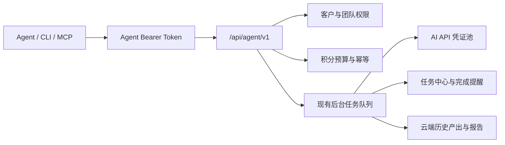

# 势途 GEO Agent 接入指南

## 设计原则

Agent、网页、CLI 和 MCP 共用同一套业务入口。Agent 不会直接读取数据库、绕过积分、修改模型 Prompt，或接触大模型供应商 API Key。



## 创建密钥

管理员进入 `/account/agents`：

1. 选择只读、业务执行或完整授权。
2. 只开放 Agent 必须访问的客户。
3. 设置每日积分上限和单任务积分上限。
4. 可选配置完整 IPv4/IPv6 白名单和到期时间。
5. 创建后立即保存明文 Token；系统不会再次展示。

生产接口默认地址为 `https://shitugeo.top/api/agent/v1`，OpenAPI 为 `/api/agent/v1/openapi.json`。

## CLI

项目目录内可直接运行：

```bash
npm run geo -- auth set --token "$SHITU_GEO_TOKEN" --base-url https://shitugeo.top
npm run geo -- clients list --json
npm run geo -- tasks list --json
```

也可以执行 `npm link` 后使用全局命令 `shitu-geo`。配置文件在 macOS/Linux 的 `~/.config/shitu-geo/config.json`，Windows 的 `%APPDATA%\\shitu-geo\\config.json`，Unix 权限固定为 `0600`。

## MCP

本地 stdio：

```json
{
  "mcpServers": {
    "shitu-geo": {
      "command": "npm",
      "args": ["run", "mcp:stdio"],
      "cwd": "/absolute/path/to/geo-strategy-system",
      "env": {
        "SHITU_GEO_BASE_URL": "https://shitugeo.top",
        "SHITU_GEO_TOKEN": "YOUR_AGENT_TOKEN"
      }
    }
  }
}
```

远程 Streamable HTTP 地址为 `https://shitugeo.top/api/agent/mcp`，认证头为 `Authorization: Bearer <Agent Token>`。

## 推荐工作流

任何会扣积分的动作都按以下顺序执行：

1. `shitu_list_clients` 获取准确的 `clientId` 和可选 `teamId`。
2. `shitu_get_client` 只读取任务需要的资料区段。
3. 使用稳定的 `requestId`，先提交 `dryRun: true`。
4. 向用户展示预计积分、问题数和模型数，并等待 Agent 宿主的执行确认。
5. 使用相同 `requestId` 正式提交。
6. 根据返回任务 ID 查询任务中心；不要保持 HTTP 长连接等待业务完成。
7. 成功后读取历史产出或下载报告。

相同 `requestId` 重试会返回原任务，不会重复创建业务任务或重复占用 Agent 日预算。

## 渗透率检测示例

```json
{
  "clientId": "client_xxx",
  "requestId": "agent_penetration_20260801_001",
  "ourBrand": "示例品牌",
  "brandAliases": ["示例英文名"],
  "industry": "示例行业",
  "competitors": [],
  "questions": [
    "示例行业有哪些值得推荐的品牌？",
    "选择示例产品时应该重点看什么？"
  ],
  "models": ["doubao", "qwen", "kimi"],
  "operation": "replace",
  "dryRun": true
}
```

提交地址：`POST /api/agent/v1/actions/penetration.run`。每个模型仍只收到用户原始疑问句，联网预检、独立回答、信源提取和品牌裁判逻辑与网页端一致。

## 难度测评示例

```json
{
  "clientId": "client_xxx",
  "requestId": "agent_difficulty_20260801_001",
  "model": "auto",
  "mode": "brand",
  "industry": "高端医疗服务",
  "region": "全国",
  "scope": "national",
  "targetBrand": "示例品牌",
  "website": "https://example.com",
  "commercial": {
    "averageOrderValue": 10000,
    "grossMarginRate": 60,
    "annualRepeatPurchases": 1,
    "riskLevel": "regulated"
  },
  "dryRun": true
}
```

## 后台任务类型

`background.run` 支持：

- `research`
- `competitorCompare`
- `diagnosis`
- `queryGeneration`
- `keywordExtract`
- `keywordAdvantages`
- `keywordStrategy`
- `keywordWebsitePrompt`
- `articleGeneration`

正文结构为 `{ clientId, teamId?, requestId, kind, payload }`。`payload` 与网页端对应功能使用同一业务结构。

## 安全边界

- Bearer Token 只保存哈希，明文只出现一次。
- Token 权限与当前账号、团队、客户权限取交集；团队撤销共享后旧 Token 也无法继续访问。
- 所有写操作记录 traceId、requestId、客户、预计积分、状态和时间，不记录密码、Cookie 或大模型 API Key。
- 默认生产灰度只允许管理员创建 Token；可通过环境变量逐步开放。
- 撤销 Token 立即生效，历史审计保留。
