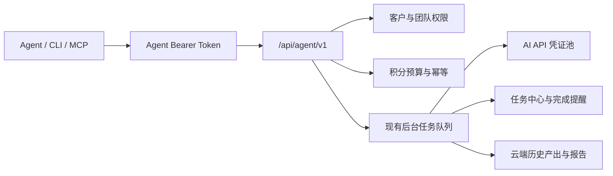

# 势途 GEO Agent 接入指南

## 设计原则

Agent、网页、CLI 和 MCP 共用同一套业务入口。Agent 不会直接读取数据库、绕过积分、修改模型 Prompt，或接触大模型供应商 API Key。



## 最快接入

所有正常登录用户都可以进入 `/account/agents`：

1. 选择 Codex、Claude、Cursor、通用 MCP、CLI 或 OpenAPI。
2. 选择只读观察或业务执行，并只开放必须访问的客户。
3. 设置每日积分上限、单任务积分上限和请求频率。
4. 创建密钥后立即复制或下载页面生成的配置。
5. 点击“测试连接”。测试只读取权限和客户目录，不扣积分。

公开说明页为 `https://shitugeo.top/agent`，生产接口默认地址为 `https://shitugeo.top/api/agent/v1`，OpenAPI 为 `/api/agent/v1/openapi.json`。

## CLI

无需下载网站源码，可直接下载独立 CLI：

```bash
curl -fsSL https://shitugeo.top/downloads/shitu-geo.mjs -o shitu-geo.mjs
node shitu-geo.mjs auth set --token "$SHITU_GEO_TOKEN" --base-url https://shitugeo.top
node shitu-geo.mjs clients list --json
node shitu-geo.mjs tasks list --json
```

配置文件在 macOS/Linux 的 `~/.config/shitu-geo/config.json`，Windows 的 `%APPDATA%\\shitu-geo\\config.json`，Unix 权限固定为 `0600`。

## MCP

远程 Streamable HTTP 地址为 `https://shitugeo.top/api/agent/mcp`，认证头为 `Authorization: Bearer <Agent Token>`。接入中心会按选择的 Agent 自动生成配置。

Codex 可在 `~/.codex/config.toml` 中使用：

```toml
[mcp_servers.shitu_geo]
url = "https://shitugeo.top/api/agent/mcp"
bearer_token_env_var = "SHITU_GEO_TOKEN"
default_tools_approval_mode = "writes"
```

Claude Code 可使用 `claude mcp add --transport http`；Cursor 和其他 MCP Agent 使用页面生成的 `mcp.json`。

## 推荐工作流

任何会扣积分的动作都按以下顺序执行：

1. `shitu_list_clients` 获取准确的 `clientId` 和可选 `teamId`。
2. `shitu_get_client` 只读取任务需要的资料区段。
3. 使用稳定的 `requestId`，先提交 `dryRun: true`。
4. 向用户展示预计积分、问题数和模型数，并等待 Agent 宿主的执行确认。
5. 使用相同 `requestId` 正式提交。
6. 根据返回的 `task.taskId` 查询任务中心；不要保持 HTTP 长连接等待业务完成。
7. 完成后读取 `task.resultUrl`，或从不可变历史产出中读取结果。
8. PDF 和文章 ZIP 使用下载端点或 MCP 受保护资源，不嵌入普通 JSON。

相同 `requestId` 重试会返回原任务，不会重复创建业务任务或重复占用 Agent 日预算。
CLI 的 `tasks watch` 会在任务长时间无新进度时自动降低轮询频率，有新进度后立即恢复，避免多 Agent 同时等待时挤占服务。

## 渗透率检测示例

```json
{
  "clientId": "client_xxx",
  "requestId": "agent_penetration_20260801_001",
  "ourBrand": "示例品牌",
  "brandAliases": ["示例英文名"],
  "industry": "示例行业",
  "competitors": [],
  "questions": [
    "示例行业有哪些值得推荐的品牌？",
    "选择示例产品时应该重点看什么？"
  ],
  "models": ["doubao", "qwen", "kimi"],
  "operation": "replace",
  "dryRun": true
}
```

提交地址：`POST /api/agent/v1/actions/penetration.run`。每个模型仍只收到用户原始疑问句，联网预检、独立回答、信源提取和品牌裁判逻辑与网页端一致。

## 难度测评示例

```json
{
  "clientId": "client_xxx",
  "requestId": "agent_difficulty_20260801_001",
  "model": "auto",
  "mode": "brand",
  "industry": "高端医疗服务",
  "region": "全国",
  "scope": "national",
  "targetBrand": "示例品牌",
  "website": "https://example.com",
  "commercial": {
    "averageOrderValue": 10000,
    "grossMarginRate": 60,
    "annualRepeatPurchases": 1,
    "riskLevel": "regulated"
  },
  "dryRun": true
}
```

## 专用动作

Agent 1.2 已将旧版 `background.run` 拆成可发现、可校验的专用动作：

| 模块 | 动作 |
| --- | --- |
| 渗透率情报 | `penetration.run` |
| 独立调研 | `research.run`、`research.compare` |
| AI 诊断 | `diagnosis.run` |
| 难度测评 | `difficulty.run` |
| 关键词策略 | `keyword.extract`、`keyword.advantages`、`keyword.strategy.run`、`keyword.website-prompt.run`、`keyword.questions.run` |
| 文章生成 | `article.generate`、`article.rewrite`、`article.batch.run` |
| 执行反馈 | `feedback.action.create`、`feedback.actions.import`、`feedback.report.create` |
| 客户资料库 | `knowledge.import`、`knowledge.commit` |
| 专业报告 | `report.create` |

每个动作在 OpenAPI 和 MCP 中都有独立 Schema。`background.run` 仅用于兼容旧 Agent，不建议新流程继续使用。

## 结果与文件

- `GET /tasks/{taskId}/result`：读取后台任务的真实业务结果。
- `POST /tasks/{taskId}/restore`：任务完成但工作区未显示时恢复结果。
- `GET /outputs`：按客户和模块分页读取不可变云端产出，模块覆盖 `penetration`、`research`、`diagnosis`、`difficulty`、`keyword`、`article`、`feedback`。
- `GET /articles/batches/{batchId}/download?scope=passed|all&variant=original|media`：下载文章 ZIP。
- `GET /reports/{jobId}/download`：下载专业报告 PDF。
- `GET /knowledge/imports/{importId}`：读取待人工审核的资料候选项；确认后调用 `knowledge.commit`。

MCP 中对应 `shitu_get_task_result`、`shitu_restore_task_result`、`shitu_get_article_batch_zip` 和 `shitu_get_report_pdf`。文件工具返回受保护资源链接，Agent 需要时再读取。

## 就绪预检

带 `dryRun: true` 的动作会同时检查参数、客户权限、团队权限、预计积分和模型账号池，不会发起模型请求或扣积分。返回 `readiness.state`：

- `ready`：可正式提交。
- `degraded`：核心动作可执行，但部分增强能力或所选模型不可用。
- `blocked`：必要模型、联网能力或账号池未准备好；接口返回 `ACTION_NOT_READY`。

## 安全边界

- Bearer Token 只保存哈希，明文只出现一次。
- Token 权限与当前账号、团队、客户权限取交集；团队撤销共享后旧 Token 也无法继续访问。
- 所有写操作记录 traceId、requestId、客户、预计积分、状态和时间，不记录密码、Cookie 或大模型 API Key。
- 正常登录用户可以创建 Token，有效密钥数量和请求频率按 VIP 等级控制。
- 客户专属账号只能访问已关联客户，团队成员只能使用已授权模块。
- 知识库原文需要独立的 `knowledge.view` 权限。
- 撤销 Token 立即生效，历史审计保留。
